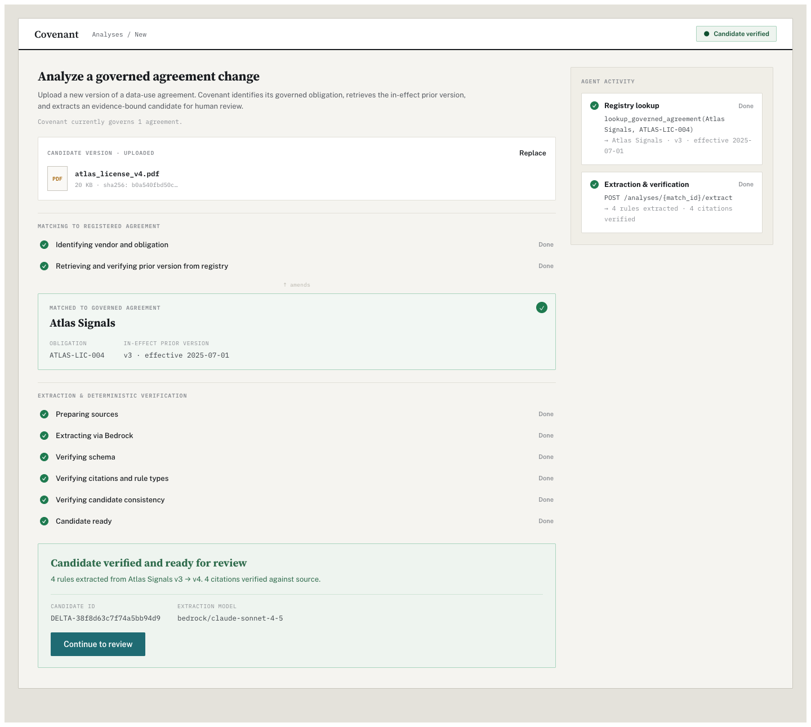
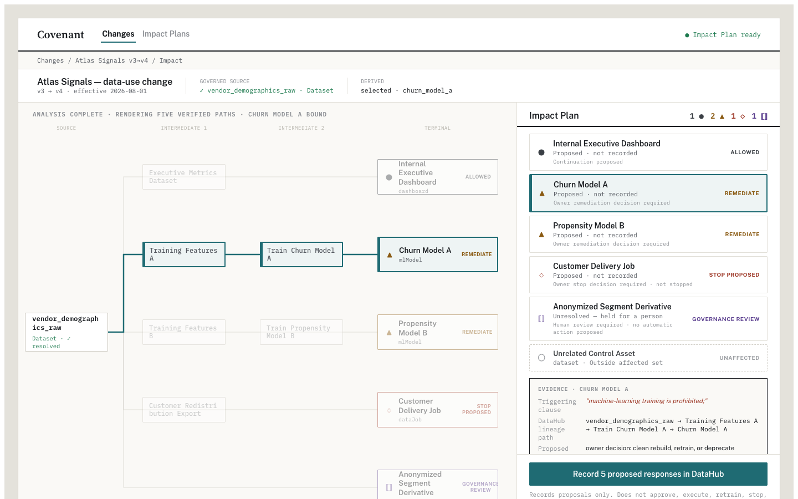

# Covenant

Covenant turns a changed data-use agreement into an evidence-bound, graph-derived response plan: it recognizes the governed agreement, propagates the verified policy change through live DataHub lineage, and records inspectable proposal receipts on native DataHub assets.





## How it works

**Recognize.** An operator uploads the synthetic Atlas Signals v4 PDF at `/analyze`. Claude Sonnet 4.5, called through Amazon Bedrock Converse, identifies the vendor and obligation, makes one tool-use lookup against Covenant's DataHub-native governed-agreement registry, and extracts four cited candidate rules. A deterministic verifier then checks the schema, source hashes, byte-exact citations, ISO date, allowed vocabulary, version relationship, and evidence state. Only a passing candidate can enter `AWAITING_REVIEW`; a verified match or extraction is not activation.

**Propagate and record.** An explicit **SYNTHETIC TEST APPROVAL** activates the fixture candidate. Live DataHub MCP calls discover the affected URNs and exact lineage paths; deterministic policy produces the canonical result of **1 allowed / 2 remediate / 1 stop proposed / 1 human review / 1 unaffected**. The DataHub SDK writes proposed-response metadata to the five affected native assets, and MCP plus SDK readbacks reconcile the receipts. Nothing is automatically stopped, approved, retrained, or enforced.

## Technologies and dependencies

- [DataHub](https://datahubproject.io/) Core Quickstart `v1.6.0` is the metadata graph, governed-agreement registry, native writeback surface, and local judge runtime.
- `mcp-server-datahub==0.6.0` supplies live search, entity, downstream-membership, and exact-lineage-path evidence.
- `acryl-datahub==1.6.0` performs native property/tag writes and detailed receipt readback; the pinned MCP server has no write tool.
- Amazon Bedrock Converse runs the tested US Claude Sonnet 4.5 inference profile (`us.anthropic.claude-sonnet-4-5-20250929-v1:0`) for agreement matching and candidate extraction.
- Python `>=3.11,<3.12`, JSON Schema `4.26.0`, and Covenant's deterministic verifier reject unsupported or malformed model output before review.
- FastAPI `0.139.2` and Uvicorn `0.51.0` expose the orchestration boundary and progress streams.
- React 18, TypeScript, and Vite 8 render the document-analysis, review, lineage, evidence, and receipt experience.
- `pypdf==6.14.2` extracts text from the bounded PDF upload surface.

## Demo

- Demo video: [Watch Covenant on YouTube](https://youtu.be/sbRDpQe-3pY)
- Devpost submission: **[add Devpost URL]**
- Native DataHub writeback proof: [view the screenshot](examples/screenshots/datahub-writeback.png)

## Run locally

### Prerequisites

- Git.
- Docker Desktop, or a compatible Docker daemon, running with enough resources for DataHub Quickstart. This project was verified with 8 GB allocated to Docker.
- Python 3.11 exactly.
- Node.js `^20.19.0` or `>=22.12.0`, plus npm.
- Internet access for Python/npm packages, Docker images, and DataHub Quickstart
  runtime checks. A later startup may still contact GitHub or a package/image
  registry when an artifact or runtime definition is not cached.
- An AWS credential accepted by the standard boto3 credential chain, or a bounded Bedrock development bearer token.
- Amazon Bedrock access to a Converse-capable Claude model or inference profile, authorization to transmit the synthetic document, and approval for the associated provider requests and cost.
- Free local ports `5173` (React), `8000` (API), `8080` (DataHub GMS), and `9002` (DataHub UI). Quickstart also binds supporting Docker services.

Clone and create the ignored local environment file:

```bash
git clone https://github.com/markbrazinski/covenant.git
cd covenant
cp .env.example .env
```

Edit `.env` and keep it uncommitted. The tested hackathon path accepts `AWS_BEARER_TOKEN_BEDROCK`; standard boto3 environment credentials, profiles, sessions, or IAM roles also work. Set `AWS_REGION=us-east-1` and set `COVENANT_BEDROCK_MODEL_ID` to an inference profile you are authorized to invoke. The example value is the profile tested by this project, not a direct foundation-model ID.

Uploads are sent to Amazon Bedrock and incur provider requests. Never put a real credential in `.env.example`, a fixture, an issue, or a commit.

In terminal 1, bootstrap DataHub, seed the synthetic graph and governed-agreement registry idempotently, and start the API:

```bash
./scripts/start_covenant.sh
```

On first use this creates `.venv`, installs the pinned Python project and test dependencies, starts/checks DataHub Quickstart `v1.6.0`, seeds only missing Covenant fixture records, and then keeps Uvicorn in the foreground. Successful startup reports the DataHub runtime, registry seed state, and:

```text
Covenant API: http://127.0.0.1:8000/docs
```

In terminal 2, verify the API and DataHub-native registry:

```bash
curl -fsS http://127.0.0.1:8000/api/health
curl -fsS http://127.0.0.1:8000/api/agreements/registered
```

Health should report `status: ok` and `datahub: connected`. The registry response should contain the synthetic Atlas Signals `ATLAS-LIC-004` record.

In terminal 3, install and start the frontend:

```bash
cd frontend
cp .env.example .env
npm ci
npm run dev
```

Open [http://127.0.0.1:5173/analyze](http://127.0.0.1:5173/analyze), upload `fixtures/atlas_license_v4.pdf`, and continue through match, extraction, deterministic verification, review, synthetic activation, impact, and record. A normal first model-backed match took roughly 9–11 seconds during qualification, with a measured provider outlier of 25.8 seconds.

Inspect native metadata at [http://localhost:9002](http://localhost:9002). The official local Quickstart's default development login is `datahub` / `datahub`; do not reuse it outside this local synthetic runtime. API documentation is at [http://127.0.0.1:8000/docs](http://127.0.0.1:8000/docs).

### Verification

With the API still running, the canonical HTTP replay idempotently selects the
canonical fixture change even when other analyses exist; it does **not** invoke
the Beat 0 Bedrock upload:

```bash
./scripts/run_verified_demo.sh
```

Run the backend and frontend suites:

```bash
.venv/bin/pytest -q
cd frontend
npm test
npm run build
```

For an intentional destructive reset/reseed of Covenant-owned synthetic fixture aspects followed by the full deterministic proof, return to the repository root and run:

```bash
./scripts/run_verified_loop.sh
```

That reset path is for verification, not ordinary startup. It writes synthetic proposal receipts.

### Troubleshooting and shutdown

- If Docker is unavailable or Quickstart returns HTTP 500, restart Docker, wait for the daemon, and rerun `./scripts/start_covenant.sh`.
- If DataHub is degraded or registry seeding times out, run `.venv/bin/datahub docker check`, then rerun the startup script.
- If the API reports `MODEL_ID_REQUIRED`, set `COVENANT_BEDROCK_MODEL_ID`. For an invoke/access error, check the AWS region, credential chain or bearer token, inference-profile access, and `bedrock:InvokeModel` permission.
- If a loopback port is occupied, keep `COVENANT_API_PORT`, root
  `COVENANT_API_URL`, frontend `VITE_COVENANT_API_URL`, and
  `COVENANT_CORS_ORIGINS` consistent. For example, use this root `.env`
  configuration for API port `8010` and frontend port `5180`:

  ```dotenv
  COVENANT_API_PORT=8010
  COVENANT_API_URL=http://127.0.0.1:8010
  COVENANT_CORS_ORIGINS=http://127.0.0.1:5180
  ```

  Then set the frontend's `frontend/.env` to:

  ```dotenv
  VITE_COVENANT_API_URL=http://127.0.0.1:8010
  ```

  Start the frontend with `npm run dev -- --port 5180`. The repository scripts
  do not remap DataHub's Quickstart ports.
- If the frontend cannot reach the API, check `/api/health` and use the
  configured frontend loopback origin exactly.
- Uploads must be text-bearing Markdown or PDF files between 1 byte and 5 MiB.
- Stop the frontend and API with Ctrl-C in their terminals. From the repository root, stop Quickstart with `.venv/bin/datahub docker quickstart --stop`.

## Repository structure

```text
covenant/                 Bedrock matching/extraction and deterministic verification
src/api/                  FastAPI orchestration, state, and progress streams
src/datahub_client/       DataHub MCP discovery plus SDK write/readback boundary
src/policy/               deterministic disposition policy
src/reconciler/           native writeback/readback reconciliation
frontend/                 React analysis and impact-plan demo
fixtures/                 synthetic agreements, graph seed, and adversarial cases
scripts/                  supported setup, demo, and qualification commands
tests/                    backend tests
examples/                 sanitized representative outputs and screenshots
```

`smoke-test/` contains ignored local run state and evidence. Production runtime code does not depend on it.

## Sample outputs

The [`examples/`](examples/) directory contains sanitized representative artifacts for:

- the model-extracted candidate delta;
- the deterministic verification result;
- the DataHub-native agreement match;
- the graph-derived impact plan; and
- the reconciled native writeback/readback.

See [`examples/README.md`](examples/README.md) for provenance and interpretation.

The [`fixtures/README.md`](fixtures/README.md) separates runtime inputs,
deterministic regression cases, and optional credentialed provider
qualifications. Qualification cases are challenge inputs, not embedded expected
answers. A qualification command exits successfully only when every selected
required case passes.

## License

Apache-2.0. See [`LICENSE`](LICENSE).

## Honest boundaries

Covenant is a reproducible local demo over fictional Atlas Signals and Northstar Commerce data. It is not a hosted service and does not include production authentication, tenancy, or external-action integrations.

The model proposes structured matching and extraction; its output is untrusted until deterministic verification passes. DataHub remains authoritative for affected-set membership, exact graph paths, and native receipts. If MCP or DataHub is unavailable, Covenant must not present a fabricated affected set.

Covenant does not make legal determinations, grant real approval, stop pipelines, retrain models, perform machine unlearning, or enforce policy. `STOP_PROPOSED` is a human-authorized action proposal, and **SYNTHETIC TEST APPROVAL** is fixture-only behavior.
